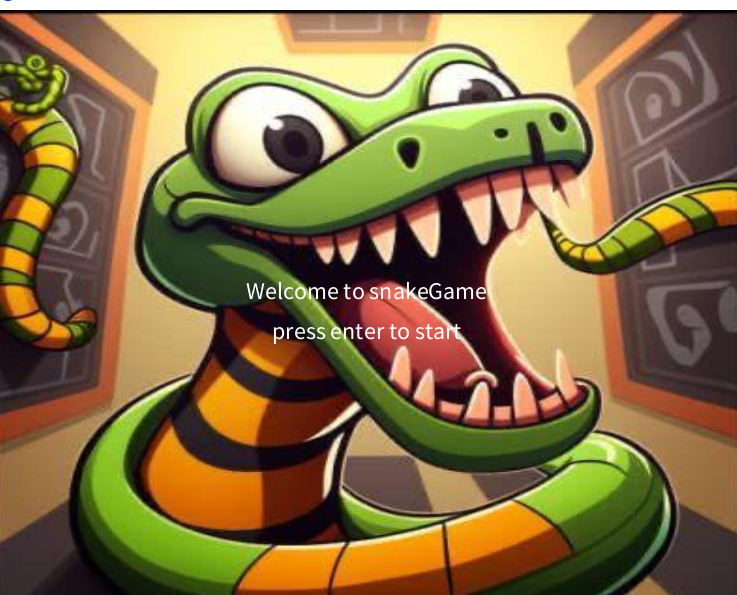
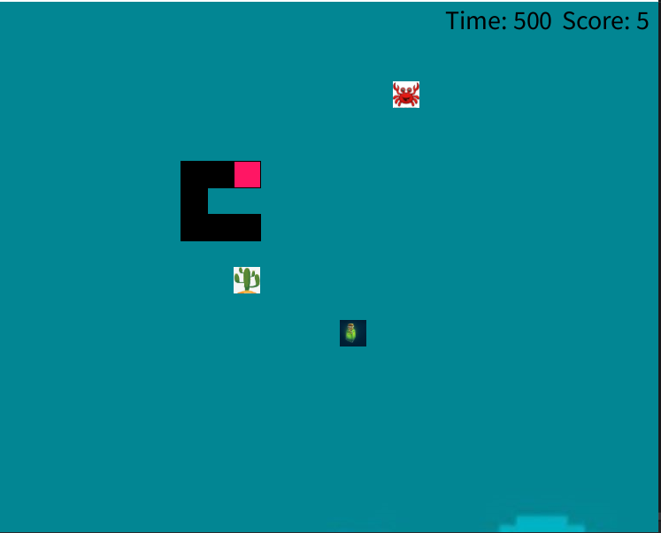

# README-Projekt 📖
Name: Mbah Tchategouang\
Vorname: Archange\
Matrikelnummer: 5451016

##  🐍 SnakeGame (Revised Edition) 🐍

Inhaltsübersicht:
1. Präsentation und Beschreibung
2. Starten des Programms
3. Ein biscchen über die Hauptklassen
4. Start des Spiels in Jshell
5. Verwendete Bibliotheken

## Präsentation und Bechreibung.

Ein Snake-Spiel ist ein unterhaltsames Spiel, bei dem der Spieler eine Schlange steuert.
Die Schlange bewegt sich geschmeidig über den Bildschirm und kann ihre Länge vergrößern, indem sie Krebstiere (Good Food) frisst.
Dadurch erhöht sich der Score des Spielers. Andererseits nimmt die Länge der Schlange ab, und der Score verringert sich, wenn die Schlange schlechtes Essen (Bad Food) konsumiert.
Der Spieler hat die Herausforderung, die Schlange so zu steuern, dass sie das schlechte Essen vermeidet, aber gleichzeitig versucht, die maximale Punktzahl zu erreichen,
bevor der Countdown abläuft. 
Die Steuerung des Spiels erfolgt intuitiv über die Pfeiltasten auf der Tastatur, wodurch der Spieler die Schlange nach oben, unten, links und rechts lenken kann. 
Es erfordert Geschicklichkeit und Strategie, um die Schlange geschickt zu steuern und den Score zu maximieren, während man gleichzeitig die Gefahr des schlechten Essens meidet.

#### wann ist das Spiel zum Ende 
- Wenn die Schlange sich selbst isst.
- Wenn der Countdown abläuft, ohne dass der Spieler die maximale Punktzahl erreicht hat.
- Wenn der Spieler schlechtes Essen (Bad Food) isst, bis der Score negativ wird.
Viel Spaß beim Spielen!

##  🛫 Starten des Programms
 . Ausführen von Snake/src/SnakeGame/Main.main();

## Über die Klassen

###  SnakeModel
Die Klasse SnakeModel enthält die Logik des Spiels, das heiß die Spielphase, Richtung und Bewegung der Schlange, 
alle Kollisionen, reduzierung der Counter und Generierung von neuen Essen.
Die Klasse verwendet ein Objekt von der klasse SnakeThread, um die Koordinaten der Essen nach eine gewisse Zeit zu verändern.
Sie hat eine Methode move(), die Zuständig für die Bewegung ist, diese Methode überprüft die Richtung der Schlange und vermeiden unerlaubte Bewegungen. Die Methode play() wir verwendet  um den Zustand des Spiels, die Position der Schlange und das Essen zu aktualisieren.

 

 ### View 
 Die View-Klasse ist für die Anzeige des Spiels verantwortlich. Um das Spiel zu starten, sollte man auf die ENTER  Taste drücken. Das Spiel wird mit der Richtungstasten gespielt.
 Die klasse view kommuniziert mit dem Controller, um 
Informationen über den Zustand des Spiels abzurufen, z. B. die Position der Schlange und des 
Essens, und verwendet diese Informationen, um die entsprechenden Elemente auf dem 
Bildschirm zu zeichnen.

### Controller
  Der Controller Klasse steuert das Spiel. Er leitet Daten des Models an der View weiter.

## Start des Spiels in Jshell  
 .  Jshell.exe --class-path .\out\production\snake\ \
 . import SnakeGame.Model.*  \
 .  SnakeModel model= new SnakeModel(); \
 .  model \
 . model.setState(GameState.PLAYING) \
 . model.play() 
 . model.setDirection(Direction.LEFT)

##  Verwendete Bibliotheken
 .  Für die Realisierung  dieses Projekts wurden folgenden Bibliotheken verwendet.\
 .  Java SE Developmemt Kit 21.0.1\
 . core.jar von Processing 4 Bibliothek für die grafische Darstellung https://processing.org/ \
 . JUnit5.8.1 für die Tests (https://junit.org/junit5/) \
 . Junit4.13.1 für die Tests (https://junit.org/junit4/). 

